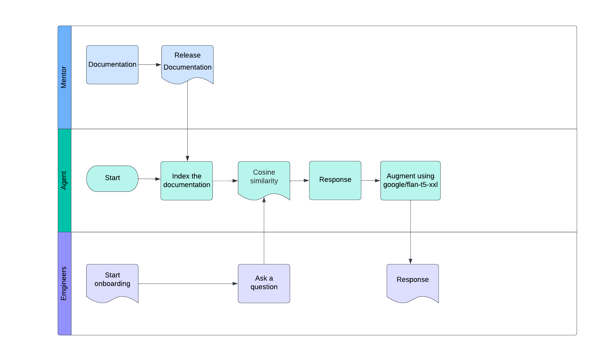
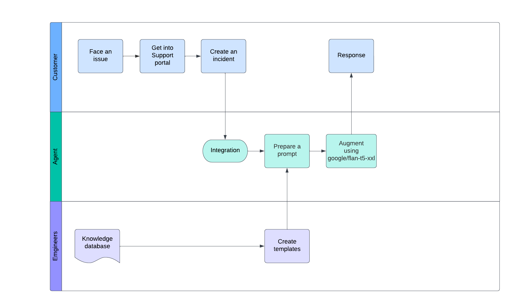

# Repository Purpose

In [An Integration](./SRE%20assistant.ipynb), you'll find a functional example of how to create an agent that assists internal employees in finding the next course to take during their onboarding process by following three major steps:

1. **Index the Content of the File**

   The content of the Onboarding Programs Document was indexed into a dictionary.

2. **Machine Learning Techniques**

   The agent uses a `cosine_similarity` technique to match the content most relevant to the employee's query.

3. **Model Integration to Augment the Content**

   The response is enhanced using the `google/flan-t5-xxl` model running on IBM Cloud.

## Use Cases

- An internal employee finishes a class and needs assistance in finding the next course to take.
- An internal employee is taking a class and needs more information about the course.

## Future Potential

We could use this solution to automatically respond to tickets created by support teams.

# Other resources
## Agent Creation for Onboarding

The goal is to create an agent that helps guide people during their onboarding process. To avoid building the agent from scratch, we will use [IBM's Prompt Lab](https://www.ibm.com/docs/en/watsonx/saas?topic=solutions-prompt-lab). This tool will allow us to create and train an agent with specific onboarding content. The idea  is to use [cloud.ibm.com](https://cloud.ibm.com) and the `granite-13b-chat-v2` model to create a prompt session, feed it with data, and enable it to respond to training and/or onboarding questions.

## Integration with External Applications

To integrate the prompt with external applications, the REST API of [cloud.ibm.com](https://cloud.ibm.com) will be used. Follow these steps:

1. **Create an API Key**:  
   Go to [IBM Cloud API Keys](https://cloud.ibm.com/iam/apikeys) to create an API key.

2. **Generate a JWT**:  
   After creating the API key, generate a JWT by following the instructions [here](https://cloud.ibm.com/docs/watson?topic=watson-iam#iam) to connect to the APIs.

## Integration Test
[An integration](./integration_test.py) test was conducted with a Python program and IBM Cloud, where a JWT token was generated. This token was then used to create a prompt with included context for answering questions.
